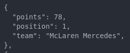
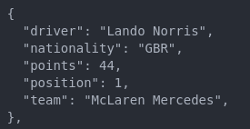
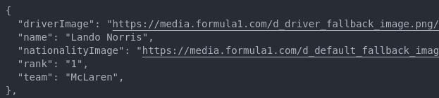
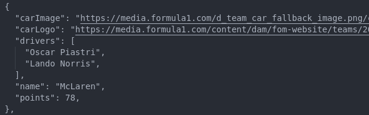
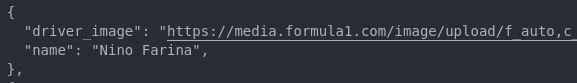
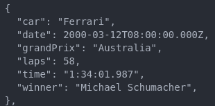
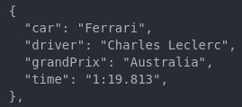

# Formula1 API

**Completely Updated and Adjusted according to the New Changes in Formula 1's Website ~ 2025!**

  

The scraper scrapes this website: <https://www.formula1.com>

## Installation

```bash
npm i f1-api-node
```

## Example snippet
  
The following function will print the current lineup of F1 drivers.

```javascript
const f1Api = require('f1-api-node') 

const myFunction = async () => {
    const driverLineup = await f1Api.getDriverData() // replace this function
    console.log(driverLineup)
}

myFunction()
```

## Functions

### **1. getConstructorStandings**  
  
| Description | Needs Paramter ? | Paramter Description | Default Argument |
|:------------|------------------|----------------------|------------------|
| Fetch Constructors standings from points table | Yes - 1 | The year from which you want to extract points table for (1950 - current) | current year |



### **2. getDriverStandings**

| Description | Needs Paramter ? | Paramter Description | Default Argument |
|:------------|------------------|----------------------|------------------|
| Fetch F1 driver standings from points table | Yes - 1 |  The year from which you want to extract points table for (1950 - current) | current year |



### **3. getDriverLineup**  

| Description | Needs Paramter ? | Paramter Description | Default Argument |
|:------------|------------------|----------------------|------------------|
| Fetch the current lineup of F1 drivers | No |  - | - |



### **4. getTeamLineup**  

| Description | Needs Paramter ? | Paramter Description | Default Argument |
|:------------|------------------|----------------------|------------------|
| Fetch the current list of F1 teams | No |  - | - |



### **5. getWorldChampions**  

| Description | Needs Paramter ? | Paramter Description | Default Argument |
|:------------|------------------|----------------------|------------------|
|   Fetch all the world champions   | No |  - | - |



### **6. getRaceResults** - **[Does Not Work]**  

| Description | Needs Paramter ? | Paramter Description | Default Argument |
|:------------|------------------|----------------------|------------------|
|   Fetch race results of all the grand prix in a given year   | Yes - 1  | The year from which you want to extract race results (1950 - current) | - |



### **7. getRaceSchedule** [DOES NOT WORK]
  
| Description | Needs Paramter ? | Paramter Description | Default Argument |
|:------------|------------------|----------------------|------------------|
| Fetch race schedule for an entire year | Yes - 1 | The year from which you want to extract race schedule | current year |

### **8. getFastestLaps**  
  
| Description | Needs Paramter ? | Paramter Description | Default Argument |
|:------------|------------------|----------------------|------------------|
| Fetch fastest laps for all races in a year | Yes - 1 | The year from which you want to extract fastest laps | current year |



## Snapshots

If you want to have a look at the output from the given functions check [this](https://github.com/yashkathe/F1-API/tree/master/__tests__/__snapshots__).

## Accessing API through Docker

The docker image of the rest api can be found on [Docker Hub](https://hub.docker.com/repository/docker/katheyash/f1-api-node/general)

- ### Pull the Image and start the development in no time  

#### 1. Pull from Docker Hub

```bash
docker push katheyash/f1-api-node:tagname
```

#### 2. Pull from Github Container Registry

```bash
docker pull ghcr.io/yashkathe/f1-api-node:2
```

- ### The default port is 80

```bash
docker run -p 80:80 --name f1-api-node-test-1 katheyash/f1-api-node:1
```

- ### If .env file exists

```bash
docker run --env-file ./.env -p 3001:3001 --name f1-api-node-test-1 f1-api-node:1
```

## Usage

WARNING: Abusing this library may result in an IP ban from the host website.  
Please use with caution and try to limit the rate and amount of your requests if you value your access to formula1.com

## Report Problems

If you have any problems regarding this project, read the following [disclaimer](https://github.com/yashkathe/F1-API/blob/master/DISCLAIMER.md).  
